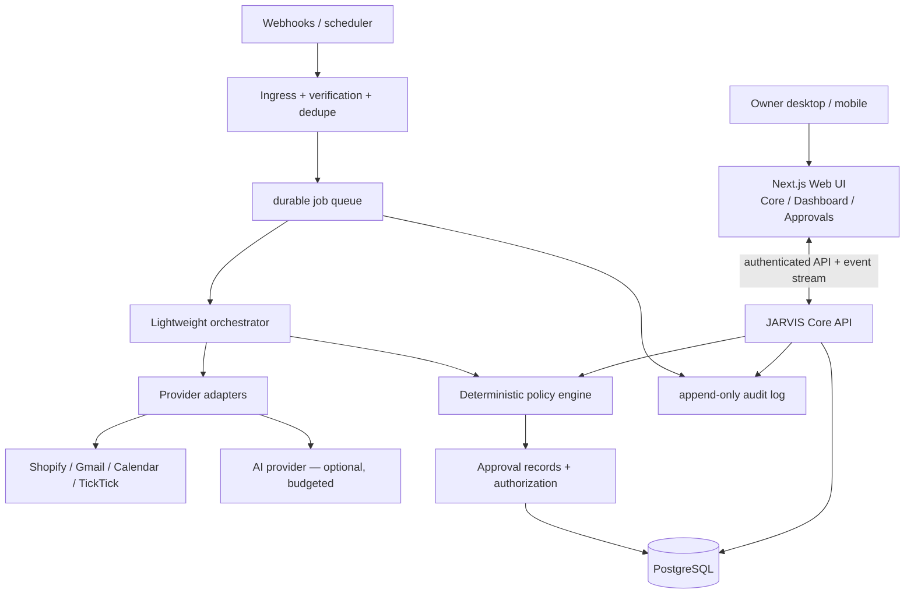

# 02 — アーキテクチャ

## 運用境界

開発IDE（Antigravity, Codex）≠ プロダクト実行環境（JARVIS CORE）。両IDEはコードと検証を共有するが、ユーザー実データ処理は独立したランタイムに置く。初期はモック実行、次に読み取り専用のAPI、安定後に権限制の実行系。

## 候補スタック（確定済み契約や導入完了を意味しない）

- Frontend: Next.js + React + TypeScript; デザイン Tailwind + design tokens; 3D React Three Fiber/Three.js（品質・GPU負荷を比較して遅延ロード）。フォーム/チャートは可読性優先。
- Backend: Node.js + TypeScript。初期M1ではNext.jsのAPI routesでもよい。Webhook処理、長時間タスク、外部呼出しは将来独立workerへ切り出す。
- DB: PostgreSQL（M1モックはローカルfixture。M2の接続段階で移行）。Migrationとバックアップ検証はM2以前に設計。
- Queue: データ損失しない永続キューをM2で選定（例: PostgreSQL系queue / Redis系、無料枠/運用負荷を比較）。M1で特定製品を強制導入しない。
- Event delivery: Webhook HMAC検証→イベントID重複判定→ジョブ化→処理記録。日次のリコンシリエーションで欠落を検知。
- AI adapter: モデル非依存の構造化入出力。v0はルールベースと固定fixture。API利用は予算とプライバシーの承認後にオン。
- Voice: フェーズ1は任意Web Speech API試用/ブラウザーTTS、必ずテキスト代替。フェーズ3でRealtime/通話サービスを比較。

## 機能モジュール

1. `briefing`: 入力情報のソース/鮮度/重要度を組み立て、朝のブリーフを生成。
2. `commerce`: Shopify読み取り/注文利益推定/仕入れ・配送アラート。
3. `creative`: MIX問い合わせ・制作案件・歌い手活動・SNS用のタスク処理。
4. `assistant`: メール/予定/ToDo/集中作業ブロック提案。
5. `policy`: 機械的な権限制御と承認トークンの照合（LLMから独立）。
6. `audit`: 発生元、イベントID、処理、入力参照、承認者、外部結果、日時を記録。
7. `presence`: UIの状態機械。実際にエージェントを実行していない場合はIDLE/DEMOと表示。

## タスクフロー例: paid order

1. Shopify注文イベント受信（初期はfixtures）。HMAC + Topic検証（本番時） → bodyを最小化して保存。
2. ストアIDと外部イベントIDなどで冪等性を確保。再送は二重発注しない。
3. タイムゾーン・送料・仕入れ・支払手数料・広告費を把握できる範囲で計算。欠損はUNKNOWN（利益確定扱いしない）。
4. 必要ならAIに**提案文章だけ**作成させ、外部データ中の命令文を無視する。
5. 発注候補をapprovalに起票。本人認証済みUI承認後にのみ、実行workerが同一対象/金額/TTLを照合して実行する（M3以降）。
6. 外部結果を保存し、エラー時は単純再送せず二重注文の有無を照合。日次リコンシリエーション。

## プロセスの状態管理

job: `queued → running → succeeded|failed|retry_wait|cancelled`（再起動後もDBから再開可能）。
approval: `pending → approved|rejected|expired|cancelled → executed|execution_failed`。実行時にapprovedの有効な、変更されていない対象だけを受理。
agent: `idle → reading → reasoning → draft_ready|awaiting_approval|error`。メインUIのアニメーションはこの状態を反映。

## デプロイの考え方

Windowsローカルで開発・GPU演出、クラウドにWebhook受信/キュー/DB/定期ジョブを配置。電源OFFでも必要な仕事を動かすのはクラウド移行後。クラウド/DB/音声の継続費用は契約前に見積もりと費用上限を提示。認証を伴う本番連携はM2以降に順次。
